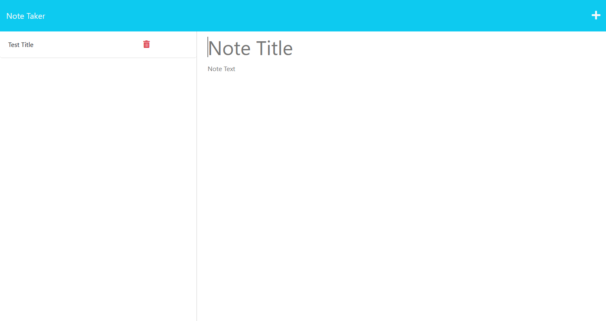

# Bootcamp Note Taker

## Description

This project connects a pre-established front end framework for note taking, to a custom back-end which allows for saving the notes and assigning them a unique ID for later viewing. A later version of the finished application would also allow for the user to delete notes.

## Installation

This application utilized Express and UUID for back end operations and assigning IDs to the user's notes.

## Usage

From the start page, click on the Note Taker button to be taken to the note-taking screen. Each note can be given a title and filled with contents of the user's choice, then saved by clicking the Save button. Saved notes are displayed on the left side of the screen, and can be re-selected to view their contents.

## Credits

N/A

## License

Please refer to the LICENSE in the repo.
